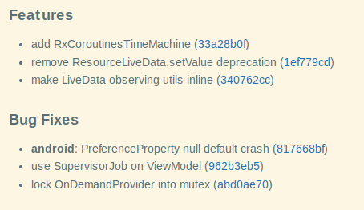
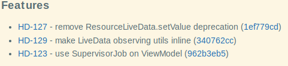

# Generate changelog action

## Usage

Before you add the action, you have to enable deep checkout in your checkout action:

```yaml
- uses: actions/checkout@v3
  with:
    fetch-depth: 0
```

then you can add the changelog action:

```yaml
  - name: Generate Changelog
    uses: inovait/actions-common/git-changelog-generator@v8
    with:
      from: efe8dc92136a28e3f9ace97e7af9ae456fd9e2d0
      to: e31a0104ee0f9831e061a62c555c9db211885b1f
      git_commit_url_prefix: 'https://github.com/inovait/actions-common/commit/'
      jira_url: 'https://inova-it.atlassian.net/'
      target_file: "CHANGELOG.MD"
```

Inputs:

* `to` (Required) - Last commit (inclusive) to generate changelog from
* `from` (Required) - Commit to start generating changelog from (exclusive)
* `git_commit_url_prefix` (Required) - URL prefix that can be used to link to a commit from this project in the web
  browser.
  For example `https://github.com/inovait/actions-common/commit/` for this repository.
* `jira_url` (Optional) - URL to the jira instance that contains tickets mentioned in commit messages
* `target_file` (Optional) - When specified, changelog will also be written to the specified file

You can also use `changelog` action step output in your workflow scripts. For example:

```yaml
  - name: Generate Changelog
    uses: inovait/actions-common/git-changelog-generator@v8
    id: my_changelog
    with:
      ...
  - run: |
      echo "My changelog is: ${{ steps.my_changelog.outputs.changelog }}"
```

## Features

### Conventional Commits

When commits are written using [Conventional Commits](https://www.conventionalcommits.org/en/v1.0.0/) spec,
generator will automatically sort commits into features and bugs, discard the rest
(refactor commits are generally not useful in changelogs) and highlight scopes:



If there are any breaking commits, they will be highlighted prominently
in a separate section above regular features and bugs.

### Jira links

If `jira_url` is specified, generator will automatically generate all links to all Jira tickets mentioned in commits:



This feature also supports Github issue links (for example `#6`). In this case, `jira_url` must contain link to the
Github repository (without a trailing slash), for example `https://github.com/inovait/myproject`.

## Building

To ensure maximum compatibility, action is built automatically when push is made into `main`.

(Action was adapted from http://hydra/utilities/jenkins-commons/-/blob/master/vars/releases.groovy changelog generator.)
