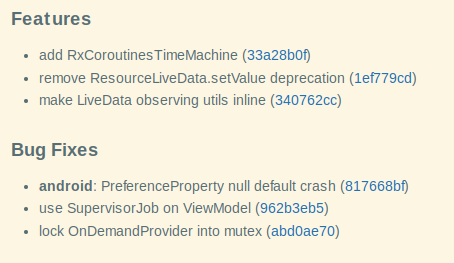
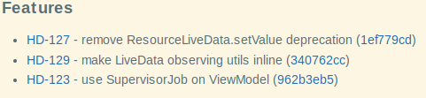

# Generate changelog action

## Usage

Before you add the action, you have to enable deep checkout in your checkout action:

```yaml
- uses: actions/checkout@de0fac2e4500dabe0009e67214ff5f5447ce83dd #v6
  with:
    fetch-depth: 0
```

then you can add the changelog action:

```yaml
  - name: Generate Changelog
    uses: inovait/actions-common/git-changelog-generator@e39161d71d6b0200b425ed4145cc4cc080c4cf56
    with:
      from: efe8dc92136a28e3f9ace97e7af9ae456fd9e2d0
      to: e31a0104ee0f9831e061a62c555c9db211885b1f
      git_commit_url_prefix: 'https://github.com/inovait/actions-common/commit/'
      jira_url: 'https://inova-it.atlassian.net/'
      target_file: "CHANGELOG.MD"
```

Inputs:

* `to` (Required) - Last commit (inclusive) to generate changelog from
* `from` (Required) - Commit to start generating changelog from (exclusive)
* `git_commit_url_prefix` (Required) - URL prefix that can be used to link to a commit from this project in the web
  browser.
  For example `https://github.com/inovait/actions-common/commit/` for this repository.
* `jira_url` (Optional) - URL to the jira instance that contains tickets mentioned in commit messages
* `target_file` (Optional) - When specified, changelog will also be written to the specified file
* `show_names` (Optional) - Whether to show author names for commits in changelog
* `excluded_name_emails` (Optional) - A list of commit author emails that should be excluded from name showing, each in
  their own line

You can also use `changelog` action step output in your workflow scripts. For example:

```yaml
  - name: Generate Changelog
    uses: inovait/actions-common/git-changelog-generator@e39161d71d6b0200b425ed4145cc4cc080c4cf56
    id: my_changelog
    with:
      ...
  - run: |
      echo "My changelog is: ${{ steps.my_changelog.outputs.changelog }}"
```

## Features

### Conventional Commits

When commits are written using [Conventional Commits](https://www.conventionalcommits.org/en/v1.0.0/) spec,
generator will automatically sort commits into features and bugs, discard the rest
(refactor commits are generally not useful in changelogs) and highlight scopes:



If there are any breaking commits, they will be highlighted prominently
in a separate section above regular features and bugs.

### Jira links

If `jira_url` is specified, generator will automatically generate all links to all Jira tickets mentioned in commits:



This feature also supports Github issue links (for example `#6`). In this case, `jira_url` must contain link to the
Github repository (without a trailing slash), for example `https://github.com/inovait/myproject`.

### Commit author attribution

By enabling `show_names` property (disabled by default), you can also list author of every commit in the changelog.

You can use `excluded_name_emails` property to exclude certain people from this feature (for example primary maintainers
of an open source project):

```yaml
  - name: Generate Changelog
    uses: inovait/actions-common/git-changelog-generator@e39161d71d6b0200b425ed4145cc4cc080c4cf56
    with:
      ...
      show_names: true
      excluded_name_emails: |
        primary.maintainer@github.com
```

## Building

To ensure maximum compatibility, action is built automatically when push is made into `main`.
